# AI Interview Prep Platform

A production-deployed full-stack coding interview preparation platform that combines **deterministic code evaluation with AI-generated coaching**.

🔗 **Live Demo:** https://interview.maahasghar.com

> Users solve coding problems, submit Python solutions for isolated evaluation, receive deterministic test results and AI-generated feedback, and track their progress over time.


---

## Overview

The AI Interview Prep Platform provides an end-to-end coding interview practice workflow.

Users can:

- browse coding problems
- write and submit Python solutions
- execute code in an isolated environment
- receive deterministic test results
- receive progressive AI coaching
- review previous submissions
- track progress over time

A core architectural principle is:

> **Deterministic systems determine correctness. AI provides coaching.**

The LLM never determines whether submitted code is correct.

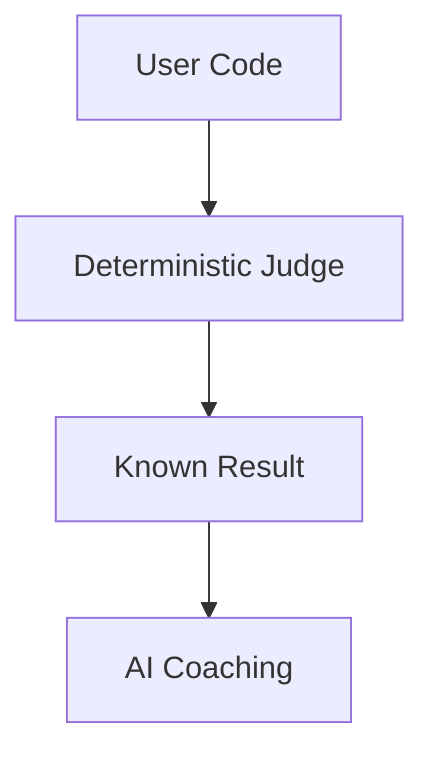

This keeps probabilistic AI behavior outside the correctness boundary.

---

# Product Preview

## Deterministic Evaluation

Submitted code is evaluated against server-side test cases.

The submission result exposes candidate-relevant information such as:

- verdict
- tests passed
- runtime
- memory usage when available
- submitted code

Hidden tests and internal execution details remain server-side.


---

## AI Coaching

After deterministic judging completes, the platform can provide structured coaching including:

- problem-solving patterns
- complexity analysis
- hints
- next steps
- suggested approaches
- example solutions


AI feedback supplements the judge rather than replacing it.

If AI generation fails after judging succeeds, the deterministic result remains valid and available.

---

## Progressive Feedback

Feedback is progressively disclosed rather than immediately revealing the complete solution.

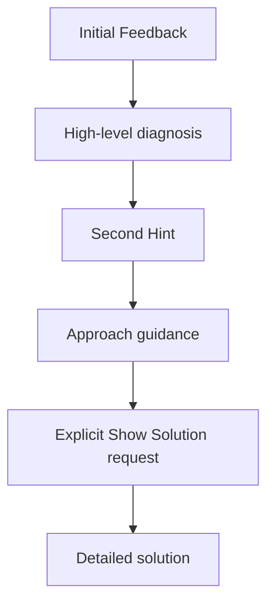


---

# System Architecture

The application separates synchronous API operations from expensive or potentially unreliable background operations.

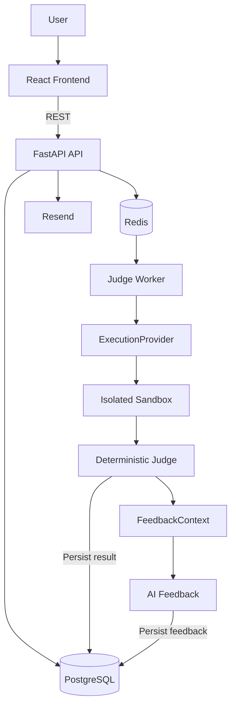

### Service Responsibilities

| Component | Responsibility |
|---|---|
| **React** | UI, authentication state, coding workflow and result presentation |
| **FastAPI** | API contracts, authentication, authorization and application orchestration |
| **PostgreSQL** | Durable users, problems, submissions, results and feedback |
| **Redis** | Job coordination, rate-limiting and temporary infrastructure state |
| **Worker** | Long-running submission processing |
| **ExecutionProvider** | Abstraction over code-execution infrastructure |
| **Sandbox** | Isolated execution of untrusted user code |
| **AI Feedback Service** | Coaching after deterministic evaluation |
| **Resend** | Transactional authentication email |

---

# Project Structure

Responsibilities are separated so transport, business logic, infrastructure and UI concerns do not become tightly coupled.

> Update this tree to match the current repository structure exactly.

```text
backend/
├── api/             API routes and HTTP contracts
├── auth/            Authentication and session lifecycle
├── models/          Persistent/domain models
├── schemas/         Validated API contracts
├── services/        Application/business logic
├── submissions/     Submission lifecycle
├── execution/       ExecutionProvider abstraction
├── feedback/        AI feedback and evaluation
└── workers/         Asynchronous job processing

frontend/
├── api/             Centralized typed API client
├── auth/            AuthProvider and protected routes
├── components/      Reusable UI components
├── pages/           Application routes/screens
└── features/        Feature-specific UI logic

docs/
├── architecture.md
├── authentication.md
├── submission-lifecycle.md
├── ai-feedback.md
├── security.md
├── production-deployment.md
├── backup-and-recovery.md
├── data-retention.md
└── images/
```

---

# Authentication Architecture

Authentication is centralized rather than implemented independently by individual frontend components.

The frontend uses:

- a centralized API client
- a single React authentication provider
- short-lived access tokens stored in memory
- refresh tokens stored in HttpOnly cookies
- centralized login/logout/session restoration
- protected routes

## Login Sequence

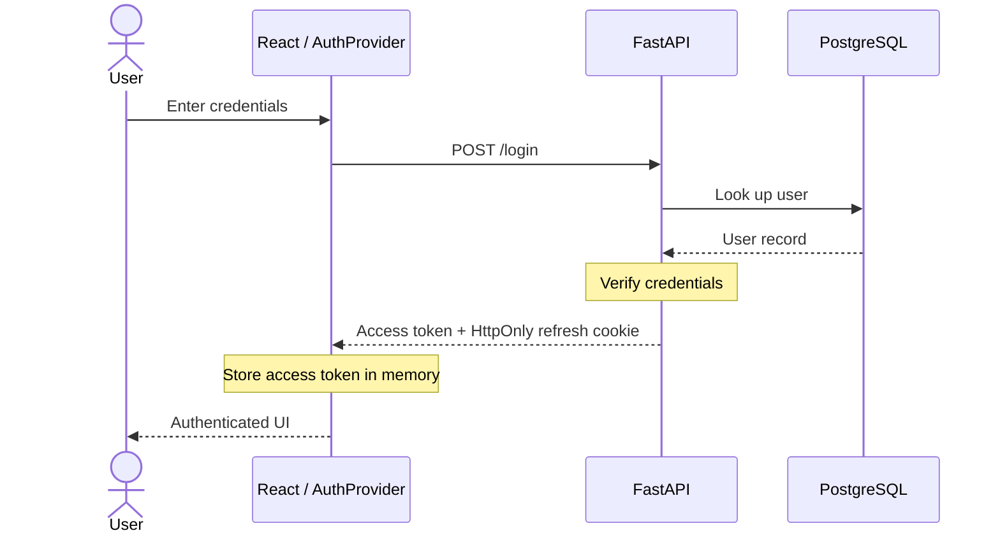

## Session Restoration

A browser refresh does not require the user to log in again while a valid refresh session exists.

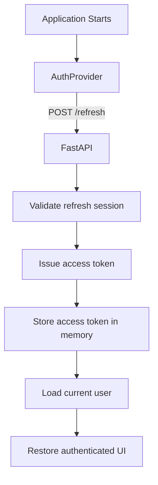

For authenticated API calls, a `401` results in at most one refresh attempt followed by one retry of the original request.

If refresh fails, authentication state is cleared.

---

# Submission Architecture

Code execution and AI generation are intentionally kept outside the normal HTTP request lifecycle.

## Submission Lifecycle

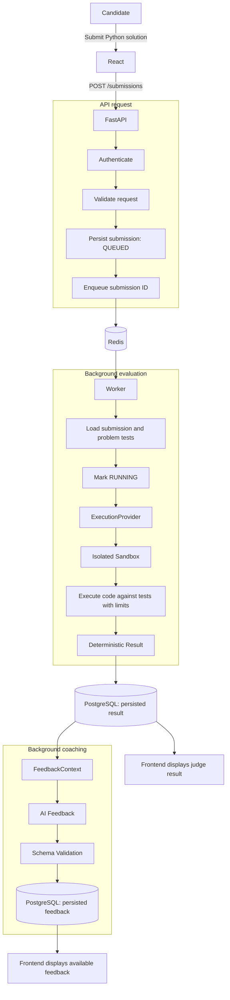

The API therefore does not need to hold an HTTP request open while sandbox execution and AI generation complete.

---

## Failure Semantics

The system distinguishes between a candidate's code failing and the infrastructure responsible for evaluating it failing.

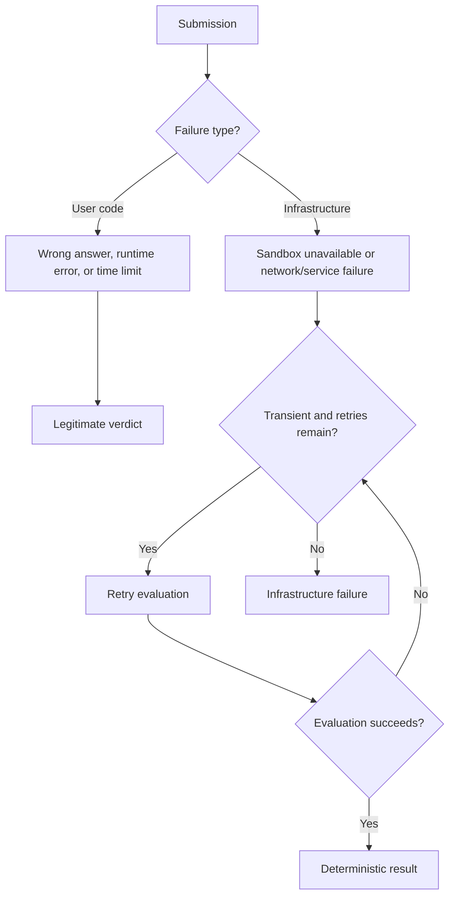

**Infrastructure failure ≠ Wrong Answer.**

Similarly:

**AI failure ≠ Judge failure.**

A successfully judged submission remains valid even when AI coaching is temporarily unavailable.

---

# AI Feedback Architecture

AI is treated as a fallible external dependency rather than a source of truth.

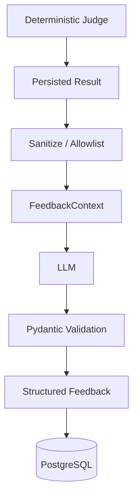

---

## Allowlisted AI Context

The model never receives arbitrary internal application objects.

A dedicated `FeedbackContext` is explicitly constructed from fields approved for AI processing.

### Allowed

- public problem statement
- constraints
- public examples
- programming language
- submitted code
- deterministic verdict
- aggregate test results
- sanitized performance/error information

### Never Included

- hidden test inputs
- hidden expected outputs
- raw judge results
- credentials
- API keys
- authentication/session tokens
- environment variables
- user identity/session information
- infrastructure internals

The system uses an **allowlist** rather than passing an internal object to the model and attempting to remove sensitive fields afterward.

---

## Structured AI Output

LLM responses are treated as untrusted external input.

Feedback must conform to a predefined schema before persistence.

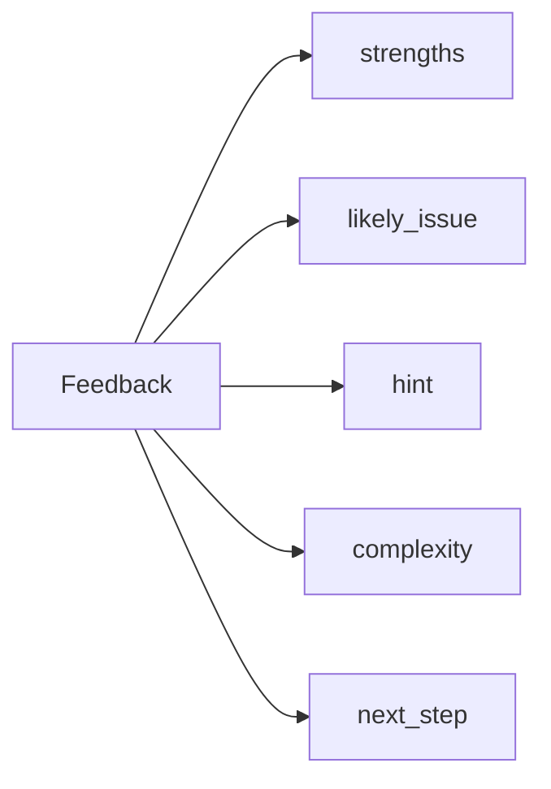

Responses are validated before storage.

Invalid responses are not persisted and can be retried according to the configured feedback policy.

Feedback is stored as structured data rather than pre-rendered Markdown so presentation remains a frontend responsibility.

---

## AI Evaluation

LLM behavior may change when the model, prompt, parameters or surrounding pipeline changes.

The project therefore maintains a fixed feedback regression suite covering scenarios such as:

- passed submissions
- failed submissions
- runtime errors
- diagnosis feedback
- hints
- solution generation
- structured-schema requirements
- forbidden-content rules

The suite is rerun when significant feedback-system inputs change.

This provides an evaluation gate before AI changes are enabled broadly.

---

# Technical Decisions

## Why FastAPI?

FastAPI provides a lightweight Python API layer with type-driven validation, asynchronous capabilities and automatic API documentation.

The application did not require the broader set of abstractions provided by a larger framework, while Python integrates naturally with the AI and code-processing portions of the platform.

**Trade-off:** more application architecture—such as authentication, background processing and service organization—must be designed explicitly.

---

## Why PostgreSQL?

The core domain is relational.

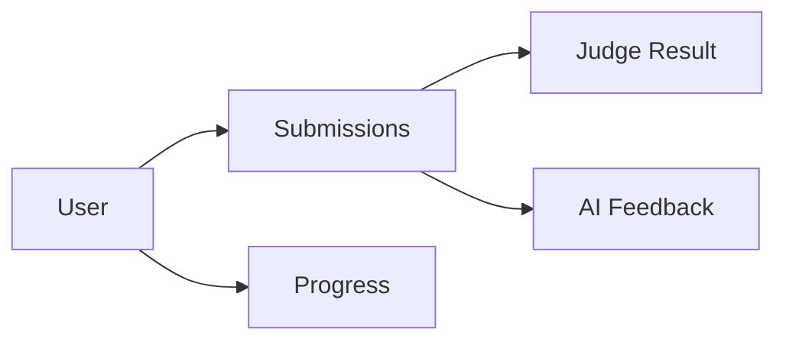

Users, problems, submissions and results have explicit relationships and benefit from transactions, constraints, indexing and aggregation.

Submission history also provides the durable source for user-progress statistics.

---

## Why Redis?

Submission processing should not depend on the lifetime of an HTTP request.

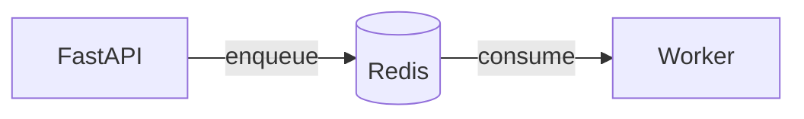

Redis provides coordination between synchronous API requests and asynchronous processing.

---

## Why a Separate Worker?

Sandbox execution and AI generation can take significantly longer than ordinary API operations.

Executing them inside `POST /submissions` would couple API availability to sandbox and AI latency.

The worker lets these operations continue independently.

**Trade-off:** asynchronous processing introduces additional deployment, recovery and observability complexity.

---

## Why an ExecutionProvider?

Code-execution infrastructure is accessed through an abstraction rather than directly from submission-processing logic.

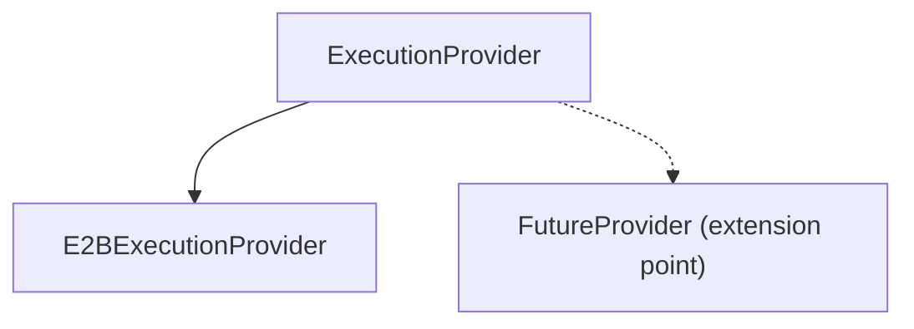

The worker depends on an execution contract rather than a particular sandbox vendor.

This boundary was introduced after encountering real portability constraints in the execution infrastructure.

---

## Why Deterministic Evaluation Before AI?

Correctness should not depend on probabilistic model output.

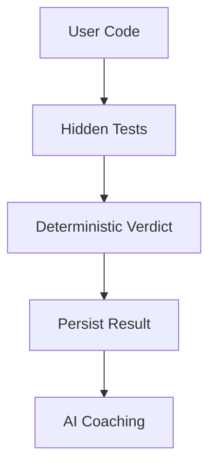

The judge answers:

> **Did the program produce the expected result?**

The AI answers:

> **How can the candidate understand or improve the solution?**

These are deliberately separate responsibilities.

---

## Why Separate Internal Judge Results From Public Responses?

The execution infrastructure knows considerably more than the candidate should receive.

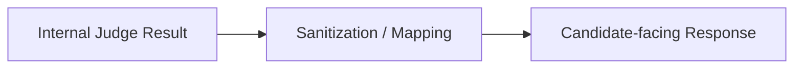

Candidate APIs expose only appropriate information such as verdict, aggregate tests passed, safe errors and performance information.

They do not expose hidden tests, expected outputs, raw judge diagnostics, container information, internal paths, commands or infrastructure stack traces.

---

# Reliability & Security

The platform treats user code, infrastructure dependencies and AI providers as separate trust/failure boundaries.

Key safeguards include:

- isolated execution of untrusted code
- server-side hidden tests
- CPU/memory/execution limits
- configurable timeouts
- bounded retry behavior
- deterministic correctness evaluation
- separate judge and AI failure states
- sanitized candidate-facing errors
- allowlisted AI context
- structured AI-response validation
- centralized authentication
- protected user-specific resources
- environment-based secrets
- rate limiting on abuse-sensitive operations
- structured security audit events

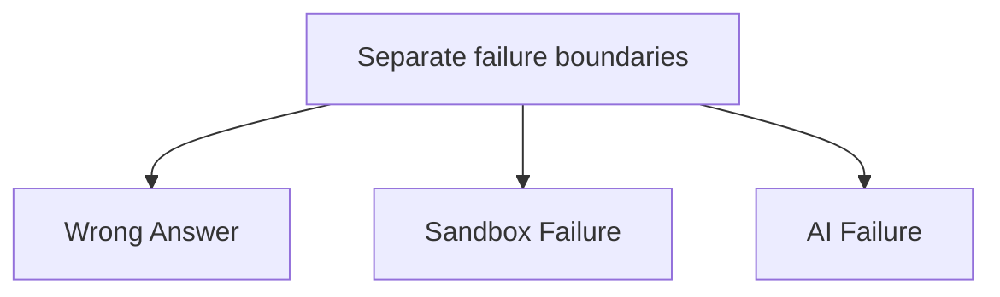

---

# Production Readiness

## Rate Limiting

Abuse-sensitive and expensive operations are rate limited according to their context rather than applying one arbitrary global limit.

Examples include authentication, submission creation and expensive AI-related operations.

Authenticated expensive operations can primarily use user identity, while unauthenticated authentication endpoints use an appropriate network-based strategy.

Rate-limit violations return `429 Too Many Requests` with a safe client-facing response.

---

## Audit Events

Security-sensitive actions generate structured audit events separate from ordinary application/debug logs.

Audit records may capture information such as:

- event type
- timestamp
- actor
- affected resource
- appropriate request metadata

They intentionally exclude:

- passwords
- password hashes
- JWTs
- refresh tokens
- verification tokens
- API keys
- authorization headers
- hidden tests
- secrets

---

## Progress Analytics

Progress summaries are derived from persisted PostgreSQL submission data.

For the MVP, statistics are calculated on demand rather than introducing unnecessary caching, materialized views or background aggregation infrastructure.

This keeps the architecture simple while leaving a clear upgrade path if query volume eventually requires precomputation.

---

## Data Lifecycle

User-related data has explicit retention and account-deletion behavior.

Account deletion handles dependent records intentionally, revokes active sessions and avoids affecting shared/global problem data.

See [`docs/data-retention.md`](docs/data-retention.md).

---

## Backup & Recovery

PostgreSQL relies on managed-provider backup capabilities rather than introducing a custom backup subsystem.

Recovery expectations, verification procedures, RPO and RTO targets are documented separately.

See [`docs/backup-and-recovery.md`](docs/backup-and-recovery.md).

---

## Accessibility & Responsive Design

The frontend implements accessibility fundamentals including:

- semantic HTML
- accessible form labels
- keyboard-accessible controls
- visible focus states
- textual success/failure indicators
- assistive-technology-friendly loading/error states
- responsive layouts
- avoidance of unnecessary horizontal overflow

The project does not claim formal WCAG certification.

---

# Tech Stack

| Layer | Technology |
|---|---|
| Frontend | React / TypeScript |
| Backend | FastAPI / Python |
| Database | PostgreSQL |
| Queue / Coordination | Redis |
| Background Processing | Dedicated Worker |
| Code Execution | ExecutionProvider / Isolated Sandbox |
| AI | LLM-based Feedback Service |
| Validation | Pydantic |
| Email | Resend |
| Deployment | Railway |
| API | REST |

---

# Testing

Testing focuses on behavior and failure boundaries rather than coverage numbers alone.

Important areas include:

- authentication and authorization
- progress aggregation
- submission state transitions
- deterministic judging
- graceful AI failure
- rate limiting
- audit-event creation
- account deletion/data handling
- sensitive-data exclusion
- API integration
- critical browser workflows

The deterministic judge is tested independently from the AI layer so correctness never depends on generated output.

---

# Local Development

Clone the repository:

```bash
git clone <repository-url>
cd <repository-name>
```

Follow the environment and startup instructions in:

[`docs/local-development.md`](docs/local-development.md)

The local environment requires the application's frontend, FastAPI backend, PostgreSQL, Redis and worker processes.

> The documentation contains the authoritative commands and required environment variables rather than duplicating environment-specific configuration here.

---

# Documentation

Detailed engineering and operational documentation lives under [`/docs`](docs/).

| Document | Purpose |
|---|---|
| `architecture.md` | System architecture and service boundaries |
| `authentication.md` | Login, refresh, logout and session lifecycle |
| `submission-lifecycle.md` | Queue, worker, judge and failure state machine |
| `ai-feedback.md` | FeedbackContext, prompts, validation and AI evaluation |
| `security.md` | Trust boundaries, hidden tests, sanitization and rate limiting |
| `production-deployment.md` | Production topology and deployment procedure |
| `backup-and-recovery.md` | PostgreSQL backup, restore, RPO and RTO |
| `data-retention.md` | Retention, deletion and session cleanup |
| `local-development.md` | Local setup and service startup |
| `testing.md` | Test strategy and important scenarios |

---

# Future Improvements

Potential future improvements include:

- additional programming languages
- additional execution providers
- richer progress analytics
- larger problem library
- improved AI evaluation datasets
- enhanced observability and tracing
- more granular execution metrics
- smarter problem recommendations
- expanded end-to-end testing

---

# Engineering Principles

The project is built around several principles:

> **Deterministic systems decide correctness. AI provides coaching.**

> **Untrusted code should not execute inside the application process.**

> **Slow work should not block HTTP requests.**

> **Infrastructure failures should not be reported as candidate failures.**

> **Sensitive internal data should cross trust boundaries through explicit allowlists.**

> **External infrastructure should sit behind replaceable boundaries where portability matters.**

> **Prefer simple, defensible MVP architecture over premature enterprise complexity.**