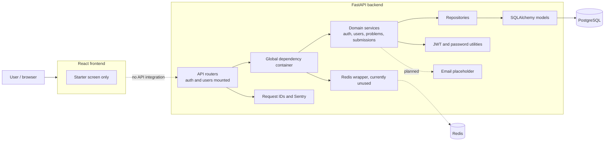
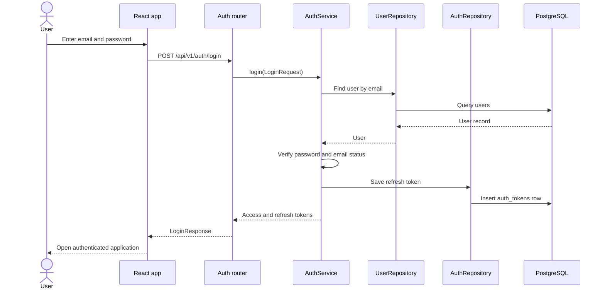
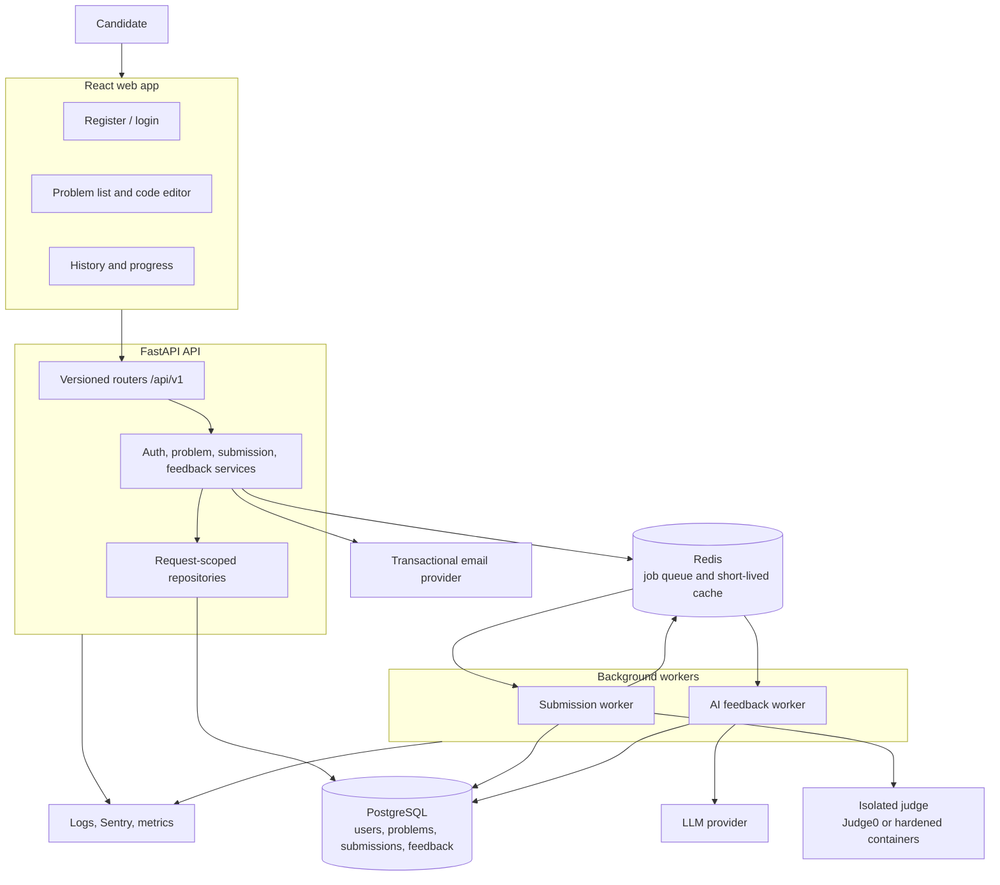
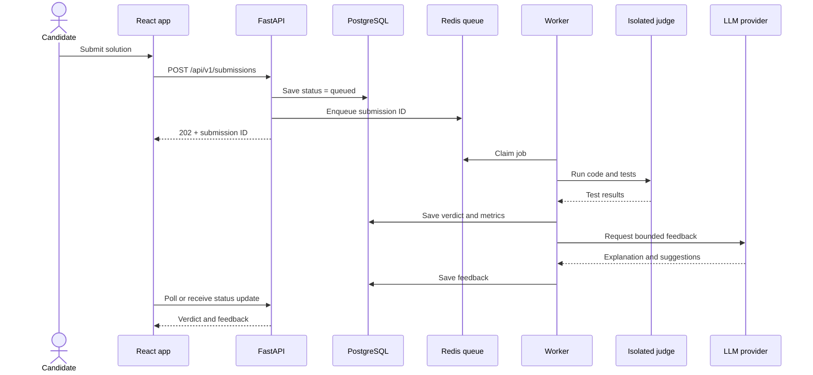

# Project guide and completion roadmap

This document describes the repository as it exists today, then proposes the
smallest architecture and delivery sequence that turns it into a usable
technical-interview practice MVP.

## 1. What this project is today

The repository is a **backend foundation**, not yet a working full-stack
product. It contains a FastAPI application with SQLAlchemy models and a
domain/repository/service structure. Authentication is partly implemented,
problem and submission persistence are scaffolded, and React is still the
Create React App starter screen.

The intended user journey appears to be:

1. Register and verify an account.
2. Sign in and maintain a profile.
3. Browse coding problems.
4. Write and submit code.
5. Run the code against test cases and save the result.
6. Receive AI feedback and track progress.

Only portions of steps 2–4 exist, and none currently form a complete end-to-end
flow.

## 2. Current architecture



### How a backend request is intended to move

```text
HTTP request
  -> router validates a Pydantic request
  -> service applies the business rule
  -> repository reads/writes SQLAlchemy models
  -> Database wrapper commits the PostgreSQL transaction
  -> router/FastAPI serializes the response
```

For example, login goes from `auth_router.login()` to
`AuthService.login()`, then reads the user through `UserRepository`, checks the
password, creates JWTs, and stores a refresh-token row through
`AuthRepository`.

### Login sequence



### Responsibilities by directory

| Area | Intended responsibility | Current state |
|---|---|---|
| `frontend/src` | Pages, UI state, API calls | Default React starter |
| `backend/app/api` | HTTP routes and dependencies | Auth/user partial; problems stubbed; submissions empty |
| `backend/app/domain` | Models, schemas, business services, repository interfaces | Useful skeleton, but coupled to SQLAlchemy and incomplete |
| `backend/app/infrastructure` | PostgreSQL, Redis, and email adapters | DB wrapper exists; Redis unused; email prints only |
| `backend/app/core` | Settings, security, logging, dependency wiring | Present, with lifecycle and auth issues |
| `backend/app/tests` | Automated behavior checks | Tests are stale relative to implementation |

This is called “clean architecture / DDD-inspired” in the README. That is a
reasonable direction, but it is not strict clean architecture: domain models
import SQLAlchemy infrastructure, repositories are concrete classes rather
than ports/interfaces, and a global container owns one long-lived DB session.
For an MVP, fixing session lifetime matters more than adding more abstraction.

## 3. What is complete, partial, and missing

### Useful foundations

- User, profile, refresh-token, problem, and submission database models.
- Password hashing and JWT creation/decoding.
- Repository/service separation for the four backend domains.
- Docker Compose definitions for backend, frontend, PostgreSQL, and Redis.
- Request IDs, Sentry initialization, formatting/lint configuration, and CI.

### Partial or broken paths

- There is no registration route; email verification does nothing.
- The API mounts routes at `/auth` and `/users`, while tests call `/api/v1/...`.
- Domain exceptions are not translated to HTTP status codes.
- Refresh tokens are stored without `expires_at`, but refresh compares that
  value to the current time.
- Role checking receives the JWT subject (an ID), then accesses `user.role`.
- The global `Database` instance keeps one SQLAlchemy session across requests.
- Problems are not mounted in `main.py`; their only route is a stub and uses an
  inconsistent import path. Submissions have no routes or schemas.
- Alembic configuration exists but there are no generated migration versions.
- The React app has no pages, routing, API client, authentication state, editor,
  or dashboard.
- The frontend container runs `npm run dev`, but `package.json` only defines
  `npm start`.
- The backend dependency file is UTF-16 and includes development/environment
  packages from a Windows freeze; this makes reproducible Linux/macOS setup
  fragile.
- A Windows `venv` and an app `.env` are tracked in Git. These should be removed
  from tracking after checking that no secret was ever committed; exposed
  secrets should be rotated.
- The tests reference removed modules, exception names, method signatures, and
  routes, so they do not describe current behavior.

### Major product capabilities not implemented

- Safe code execution/judging.
- AI feedback, hints, mock interviewing, or any AI provider integration.
- Progress analytics and practice recommendations.
- Admin problem management.
- Production deployment, health/readiness endpoints, and end-to-end testing.

## 4. Recommended MVP architecture

Keep FastAPI, React, PostgreSQL, and Redis, but add a separate asynchronous
worker and an isolated code-execution provider. **Never execute untrusted user
code inside the API process or on the API host without a hardened sandbox.**



### Submission lifecycle



Start with polling (`GET /submissions/{id}`) rather than WebSockets. It is much
simpler and sufficient for an MVP.

## 5. Delivery plan

### Phase 0 — make the repository trustworthy

Goal: a new developer can clone, run, and test the system.

- Remove tracked environments/secrets, expand `.gitignore`, and add
  `.env.example`.
- Replace the UTF-16 dependency freeze with a small UTF-8 runtime requirements
  file plus development dependencies (or adopt one modern package manager).
- Correct the frontend Docker command and add Compose health checks/volumes.
- Establish `/api/v1`, CORS, `/health`, app startup/shutdown, and request-scoped
  DB sessions.
- Generate the initial Alembic migration and import every model into migration
  metadata.
- Rewrite tests around the public API; use a disposable test database and make
  CI run backend and frontend checks.

**Exit criterion:** one documented command starts the stack; CI is green from a
clean checkout.

### Phase 1 — complete identity and authorization

- Add register, login, refresh, logout, verify-email, and current-user routes.
- Use validated email/password schemas, handle duplicates, and map every domain
  error to a safe 4xx response.
- Store refresh-token hashes and expiry, validate JWT type, rotate refresh
  tokens, and revoke token families on reuse/logout.
- Resolve the authenticated user from the DB before role checks.
- Decide whether email verification is required for MVP; if yes, connect a real
  provider and provide resend/expiry behavior.

**Exit criterion:** API tests prove registration through authenticated profile
access, refresh rotation, logout, and forbidden admin access.

### Phase 2 — deliver the practice loop without AI

- Define problem and submission Pydantic schemas and CRUD/read routes.
- Add seed problems and an admin-only problem workflow.
- Build React routes for auth, problem browsing, problem detail/editor,
  submission result, and history.
- Add a typed API client and one centralized authentication/session mechanism.
- Queue submissions and integrate an isolated judge for one language first
  (Python is the simplest starting point).
- Do not expose hidden test cases or arbitrary judge internals in API responses.

**Exit criterion:** a user can sign in, solve a seeded problem, receive a
verdict, and see the attempt in their history.

### Phase 3 — add one focused AI feature

- Generate feedback only after deterministic judge results exist.
- Send the problem, user code, and sanitized test summary to the model; do not
  send secrets or hidden expected outputs.
- Require structured output with strengths, likely issue, hint, complexity, and
  next step. Validate it before saving.
- Add prompt/version/model metadata, timeouts, retries, rate limits, cost
  tracking, and a non-AI fallback.
- Evaluate feedback on a small fixed dataset before enabling it broadly.

**Exit criterion:** feedback is asynchronous, bounded in cost, traceable, and
never blocks the judge verdict.

### Phase 4 — product readiness

- Add progress summaries, accessibility/responsive UI, loading/error states,
  rate limiting, audit events, backups, and data-retention controls.
- Add unit, API integration, and browser end-to-end tests for the critical user
  journey.
- Deploy separate web/API/worker services with managed PostgreSQL and Redis;
  add readiness checks, dashboards, alerts, and rollback instructions.

**Exit criterion:** the critical journey is monitored and recoverable in a
production-like environment.

## 6. Suggested first milestone

Do not start with the AI feature. The highest-value first milestone is a
**vertical slice**:

> Register/login → browse seeded problems → submit Python → see verdict → view
> submission history.

Build it in this order:

1. Repository hygiene and reproducible local startup.
2. Database migrations and request-scoped sessions.
3. Correct, tested authentication.
4. Problem read APIs and seed data.
5. Submission API plus isolated judge integration.
6. Minimal React screens connecting those APIs.
7. AI feedback after the deterministic loop works.

This order exposes integration risks early and produces a demonstrable product
before investing in optional sophistication.

## 7. Decisions to make before implementation

- **Audience:** coding-practice candidates, live mock-interview candidates, or
  both? Choose one for the MVP.
- **Judge:** managed Judge0-style service or self-hosted hardened runners? A
  managed service is faster for an MVP; self-hosting offers control but creates
  substantial security/operations work.
- **Languages:** begin with Python only or support several immediately? Python
  only keeps the first vertical slice small.
- **AI value:** post-submission feedback, conversational interviewer, or adaptive
  recommendations? Post-submission feedback best matches the existing model.
- **Auth delivery:** email verification now or after the practice loop? If the
  app is initially a portfolio/demo, deferring real email can reduce scope.
- **Deployment:** select a platform only after the web/API/worker boundaries and
  judge choice are clear.

## 8. Practical code-reading path

To reacquaint yourself with the code, read in this order:

1. `backend/app/main.py` — what FastAPI actually exposes.
2. `backend/app/core/container.py` — how concrete objects are wired.
3. One vertical path: `auth_router.py` → `auth/service.py` → auth and user
   repositories → models → `infrastructure/db.py`.
4. `core/security.py` — token and password behavior.
5. Problem/submission models, repositories, and services — intended next
   domains, currently not exposed.
6. Tests — useful as historical intent, but not current specification.
7. Compose and Dockerfiles — intended runtime topology.
8. `frontend/src/App.js` — confirms the UI has not started yet.

When changing a feature, follow the same vertical path from HTTP contract to
business rule to persistence and back, then write the API test before building
the corresponding screen.
