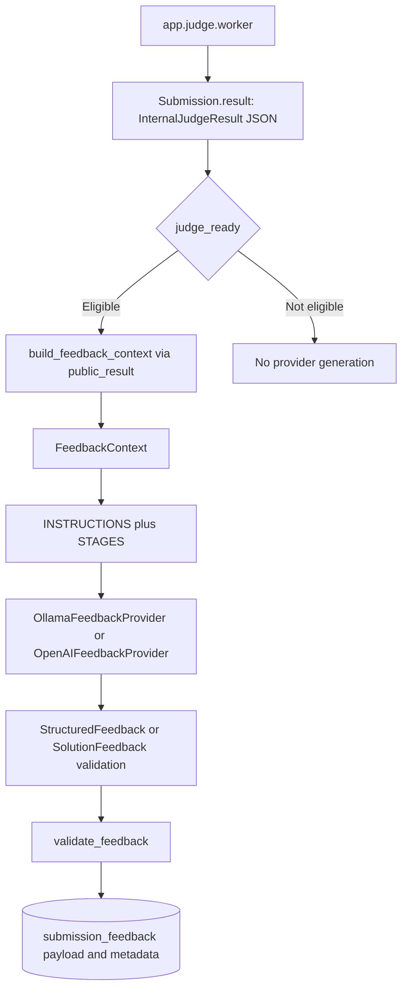

# AI Feedback

The coaching pipeline uses [policy.py](../backend/app/feedback/policy.py), [provider.py](../backend/app/feedback/provider.py), [service.py](../backend/app/feedback/service.py), [worker.py](../backend/app/feedback/worker.py), and the [Feedback model](../backend/app/feedback/models.py).



## Why Is the Deterministic Judge the Source of Truth?

The judge asks, “Did the program produce the expected result?” It runs supplied tests and compares decoded return values to expected values in the worker. AI asks, “How can the candidate understand or improve the solution?” It receives the persisted verdict, not authority to change it.

This avoids a probabilistic model assigning correctness. The comparison rule is repeatable, but arbitrary user programs and runtime environments need not be deterministic; passing also proves only the tested cases. Feedback workers update `submission_feedback`, never the submission verdict. The cost is a second lifecycle and potentially delayed or unavailable coaching. Reconsider the pedagogical workflow when adding new exercise types, without treating model opinion as an executable test result.

## Eligibility and Stages

`judge_ready` requires a terminal `Submission.status`, parseable `InternalJudgeResult`, matching status, valid aggregate counts with `tests_total > 0`, and a supported verdict code. `UNAVAILABLE`, `INVALID_TESTS` and `UNSUPPORTED_LANGUAGE` are excluded. Failed candidate submissions can qualify, including runtime errors and output-limit failures; passing is not a prerequisite.

| Action / stage | Behavior |
|---|---|
| `diagnosis` / `DIAGNOSIS` | Initial feedback is scheduled automatically after an eligible result; explains broad issues. |
| `hint` / `HINT` | Requires a `READY` diagnosis row. The server checks readiness, not whether the user actually read it. |
| `show_solution` / `SOLUTION` | Explicit user action; it does not require a prior hint or diagnosis. Must contain Python `solution_code`. |

Feedback statuses are `QUEUED`, `RUNNING`, `READY`, `FAILED`. `public_feedback` revalidates stored payloads and exposes malformed `READY` records as failed. Legacy solutions may be recovered from a fenced code block in `next_step` when `solution_code` is absent.

## Why Use FeedbackContext?

`build_feedback_context` constructs a fresh object rather than serializing a submission or ORM graph. Its exact fields are:

| Field | Source |
|---|---|
| `problem_title` | `Problem.title` |
| `problem_description` | `Problem.description`, including any constraints written there |
| `problem_categories` | `Problem.categories` or an empty list |
| `public_examples` | Parsed `Problem.test_cases` |
| `language` | Submission language; only `python` allowed |
| `submitted_code` | User source |
| `verdict` | Persisted submission status |
| `tests_passed`, `tests_total` | Aggregate counts projected by `public_result` |
| `runtime_ms`, `memory_bytes` | Safe available measurements from that projection |
| `error_message` | Fixed public result message for `RUNTIME_ERROR`, otherwise null |

There is no separate constraints field, raw execution-output field or exception traceback. Hidden tests/answers, per-case actual values, internal diagnostics, environment variables, credentials, keys, user IDs and session data are not selected. Public examples intentionally include their public expected answers. Length limits and `extra="forbid"` constrain the object shape.

The benefit is that adding private fields to a database model does not automatically add them to the prompt. The cost is maintaining the projection and possibly less diagnostic detail for coaching. User source or problem text can itself contain sensitive information: allowlisting does not redact arbitrary secrets embedded in those strings. Reconsider the fields only with explicit privacy and usefulness review. See [security](security.md).

## Prompts and Providers

`INSTRUCTIONS` tells the model to treat submitted source/problem text as untrusted data, avoid hidden-test claims and preserve the judge verdict. `STAGES` requests diagnosis, high-level hints or a complete `solve` implementation. These are instructions, not a security guarantee.

Ollama receives `POST /api/chat`, `stream=false`, JSON schema in `format`, temperature 0.2 and configured thread/token limits. The OpenAI adapter sends an HTTP request to the Responses endpoint with the context, schema and `store=false`. This documents the checked-in adapter, not a verified live-provider compatibility test or provider retention guarantee. There is no automatic provider failover.

## Structured Output Validation

`StructuredFeedback` forbids extra fields and requires:

- `strengths`: 1–5 strings.
- `likely_issue`, `hint`: optional nullable strings, at most 2,000 characters each.
- `complexity`: `time` and `space`, each 1–200 characters, with no extra fields.
- `next_step`: 1–2,000 characters.

`SolutionFeedback` additionally requires `solution_code` of 1–16,000 characters. It strips surrounding whitespace, calls `ast.parse`, and requires a top-level synchronous `FunctionDef` named `solve`. This does **not** execute the suggested code, verify its signature against the problem, or establish correctness. Valid JSON alone is insufficient: Markdown-fenced Python, invalid syntax or a differently named function can fail validation.

Providers validate content before returning serialized JSON; the worker validates again before saving `Feedback.payload` as JSON text. Production schema validation does not enforce all stage instructions: a diagnosis hint must be null and hints must omit code fences in the evaluation fixture, but these restrictions are not general runtime schema validators. The frontend renders text/code without raw-HTML insertion.

The trade-off is rejecting potentially useful malformed answers in exchange for a stable UI/data contract. Revisit constraints using regression cases; do not bypass validation merely because an HTTP request returned 200.

## AI Reliability and Traceability

Defaults below come from [Settings](../backend/app/core/config.py); deployment environment values can override them.

| Control | Current behavior |
|---|---|
| Rollout | Both `FEEDBACK_AI_ENABLED` and `FEEDBACK_EVALUATION_PASSED` default false and must be true for `build_feedback_provider` to enable inference. Otherwise it constructs `DisabledFeedbackProvider`. |
| Provider/model | `FEEDBACK_PROVIDER` defaults to `openai`; `FEEDBACK_MODEL` must be set for generation. `ollama` selects Ollama; other values take the OpenAI branch. |
| Timeout | `FEEDBACK_TIMEOUT_SECONDS=120`, validated up to 1,800; HTTP connect timeout is five seconds. |
| Retries | `FEEDBACK_MAX_RETRIES=1` permits two total attempts. Value/validation errors, HTTP 429/5xx, network errors and timeouts are retryable. |
| Backoff | `FEEDBACK_RETRY_BACKOFF_SECONDS=2`, multiplied by attempt number; numeric `Retry-After` is honored for 429, otherwise at least five seconds. |
| Ollama | `OLLAMA_NUM_THREAD=1`, `OLLAMA_NUM_PREDICT=1024` are code defaults, not assertions about a deployed `.env`. |
| Traceability | Provider, model, prompt/schema versions, source, generation timestamp, attempts, error type, token counts, latency and estimated cost are stored. Successful-provider metadata is only available after validation. |
| Versions | `FEEDBACK_PROMPT_VERSION` and `FEEDBACK_SCHEMA_VERSION` are operator-controlled labels, not hashes automatically derived from source. |
| Cost | OpenAI estimates use configured per-million input/output rates, which default to zero. Ollama records zero API cost; compute cost is not measured. |
| Output size | Provider response text over 256,000 characters is rejected after the HTTP body is read; this is not a streaming memory cap. |

After unsuccessful generation, `DIAGNOSIS` and `HINT` use `deterministic_feedback` and can finish `READY` with `source="fallback"`. `SOLUTION` finishes `FAILED` without a payload; generic review text cannot stand in for code. Disabling AI leads to the same fallback distinction.

Duplicate protection combines the unique `(submission_id, stage)` constraint, submission row lock during user requests, conditional worker claim, and fenced final write. Existing queued/running/ready work is reused. A heartbeat thread renews active feedback claims every 30 seconds. Reconciliation between jobs runs approximately every five seconds, recreates missing diagnoses, dispatches queued rows and marks claims stale after three minutes as `FAILED`. Interrupted generation needs explicit retry to bound repeated charges; external calls are not exactly once.

The worker logs error types and allowlisted validation locations, not full provider responses. Metadata is useful for diagnosis, but token/cost totals are not comprehensive billing accounting for failed attempts. See [submission failure semantics](submission-lifecycle.md).

## AI Evaluation

[evaluation.py](../backend/app/feedback/evaluation.py) defines four fixed cases: `passed-diagnosis`, `failed-hint`, `runtime-diagnosis`, and `failed-solution`. It checks schema validity, case-specific forbidden phrases, null diagnosis hints, absence of hint code fences, and solution code/explanation presence. It does not run suggested solutions, comprehensively test prompt injection or grade educational quality.

With backend dependencies and required settings loaded, run from `backend/`:

```sh
python -m app.scripts.evaluate_feedback --report /tmp/feedback-evaluation.json
```

The [CLI](../backend/app/scripts/evaluate_feedback.py) invokes the selected real provider directly, including when rollout flags are off, writes versioned results and exits nonzero if any case fails. It does not set `FEEDBACK_EVALUATION_PASSED`; review and setting that flag remain manual. Rerun after model, prompt, schema or generation-parameter changes. Review reports before sharing because schema-error details can include model output.

[CI](../.github/workflows/ci.yml) runs backend tests and mocked provider/worker checks, not this live-provider gate. From the repository root, its relevant commands are:

```sh
pytest backend/app/tests
PYTHONPATH=backend python -m unittest discover -s backend/tests -v
```

Use a disposable test database: backend fixtures recreate tables. The small evaluation fixture is a starting regression gate; expand it when real failures reveal missing scenarios.
