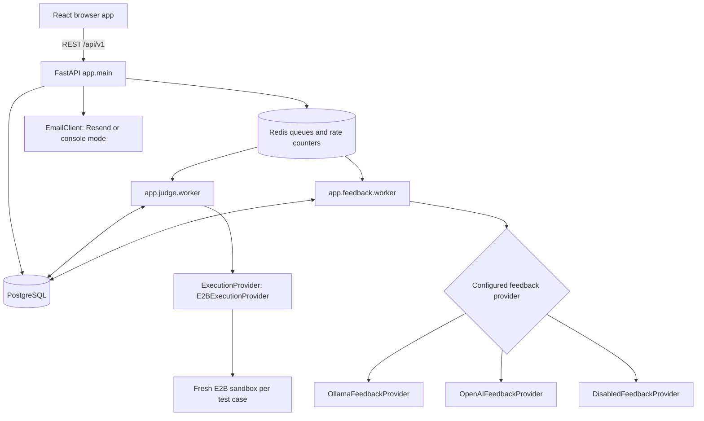
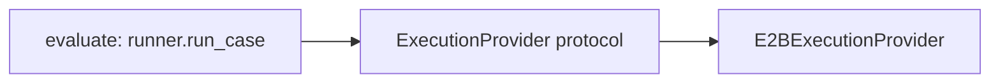

# Architecture

This is the implementation supported by the repository, not an inventory of a live deployment. The production Compose file and combined worker image offer different process topologies. Railway is described in the root README, but no checked-in Railway service manifest verifies the deployed domains, replicas, database plan, or backup settings.

## Component Responsibilities

| Component | Responsibility and data ownership |
|---|---|
| React | Public landing and account routes; protected problem workspace, submissions, history and progress. Keeps access credentials in memory; no durable business state. |
| FastAPI | Authentication, role/ownership checks, validation, persistence and enqueueing. Mounted routers use `/api/v1`; it does not execute submissions. |
| PostgreSQL | Durable users, profiles, hashed session/account tokens, problem bank, submissions/results, feedback and audit records. Also the recoverable job ledger. |
| Redis | Deduplicating work queues, expiring rate counters and worker heartbeat keys. Business records can reconstruct queue work. |
| Judge worker | Claims submissions, loads public and hidden tests, invokes the execution provider, compares results and commits a terminal verdict. |
| E2BExecutionProvider | Creates remote sandboxes, writes the per-case runner/input/source, enforces command timeouts, maps provider errors and cleans up. |
| Feedback worker | Builds approved model context from persisted results; validates and persists coaching without changing submission correctness. |
| Feedback providers | Ollama or OpenAI inference; disabled provider when rollout flags are off. Provider choice and model are configuration, not automatic failover. |
| EmailClient | Sends verification/reset links through Resend when configured. Default console mode skips delivery and logs only the subject. |

See [submission lifecycle](submission-lifecycle.md), [authentication](authentication.md), and [AI feedback](ai-feedback.md) for contracts and failure behavior.

## Responsibilities by Directory

| Repository location | Actual responsibility |
|---|---|
| [backend/app/main.py](../backend/app/main.py) | Router mounting, CORS, startup DB/Redis checks, exception handlers and health routes. |
| [backend/app/api/v1/routers](../backend/app/api/v1/routers) | Auth, users, problems and submissions HTTP endpoints. |
| [backend/app/domain](../backend/app/domain) | `auth`, `user`, `problems`, `submissions`: models, schemas, services and repositories. These are pragmatic layers: services import FastAPI and SQLAlchemy in places, not framework-independent DDD. |
| [backend/app/core](../backend/app/core) | Settings, security, request logging, Sentry, rate limiting and dependency container. The container owns shared Redis/email clients and builds services with request-scoped DB sessions. |
| [backend/app/infrastructure](../backend/app/infrastructure) | SQLAlchemy engine/session wrapper, Redis client, queue, email delivery and worker heartbeats. |
| [backend/app/judge](../backend/app/judge) | Current E2B execution adapter and deterministic judging worker. |
| [backend/app/feedback](../backend/app/feedback) | Context/output models, prompt/provider adapters, feedback service, worker and evaluation fixture. |
| [backend/app/scripts](../backend/app/scripts) | Problem seeding, feedback evaluation CLI and combined process supervisor. |
| [backend/alembic](../backend/alembic) | Schema migrations; run Alembic from `backend/`. |
| [backend/judge](../backend/judge) | Legacy container runner artifacts; not the implementation selected by the current judge worker. |
| [frontend/src](../frontend/src) | `App.js` routing, `auth.js`, typed `api.ts`, `ui.js`, `FeedbackPanel.js`, and `pages/`. React components are mostly JavaScript, not an entirely TypeScript frontend. |
| [backend/app/tests](../backend/app/tests), [backend/tests](../backend/tests), [frontend/e2e](../frontend/e2e) | API/domain tests, worker/provider tests, and browser journeys. |

## Deployment Topologies and Health

[Production Compose](../docker-compose.production.yml) defines `web` (Nginx/React), `api`, `judge-worker` and `feedback-worker`; database and Redis URLs come from the deployment environment. It does not provision PostgreSQL, Redis or Ollama itself. [Nginx](../frontend/nginx.conf) provides SPA route fallback, not an API reverse proxy; `REACT_APP_API_URL` is a frontend build argument.

[Local Compose](../docker-compose.yml) also provisions PostgreSQL 15, Redis 7 with AOF, and a separate Ollama service. The judge uses E2B even when its worker runs in Docker; there is no Docker socket requirement.

For the combined Railway-style service, [Dockerfile.worker](../backend/Dockerfile.worker) defaults to [start_workers.sh](../backend/start_workers.sh), which invokes `app.scripts.run_workers`. `Supervisor` starts Ollama, waits for its API, pulls `FEEDBACK_MODEL` if missing, then starts both workers. It forces loopback Ollama connectivity; `OLLAMA_MODELS` defaults to `/data/ollama`. Persistent volume attachment must be configured by the operator. Child exit stops the service; SIGTERM reaches process groups, with forced shutdown after ten seconds. Both Compose files override this image's command for their standalone judge worker.

The benefit is a deployment option with fewer services; the trade-off is shared failure and resource contention among inference and both workers. Split these processes when independent scaling, availability or model memory requirements warrant it.

`/health` is liveness only. `/ready` and `/readyz` query PostgreSQL and ping Redis, but do not verify worker, E2B, email or AI readiness. Worker heartbeat keys expire after 30 seconds and are written between jobs; a long job can outlast that TTL. Do not treat these keys as definitive per-job health.

## Why Redis?

Submission requests must hand off slow work without keeping the request open. [SubmissionQueue](../backend/app/infrastructure/submission_queue.py) uses sorted sets `judge:submissions` and `coach:feedback`, with IDs as members and scores. `ZADD` deduplicates dispatch; `BZPOPMIN` consumes the lowest ID with a two-second blocking timeout. PostgreSQL conditional claims, rather than Redis alone, prevent competing consumers from accepting the same current claim.

Redis also stores fixed-window `rate:*` counters and `health:worker:*` keys. It is not a response cache or the refresh-session database. [RedisRateLimiter](../backend/app/core/rate_limit.py) fails open on Redis errors; API startup/readiness still requires Redis connectivity. Feedback additionally checks recent PostgreSQL feedback-row counts.

PostgreSQL stays authoritative because submission/feedback rows survive an enqueue failure or Redis loss. Reconciliation rebuilds pending work. This trades a second service and eventual consistency for short API requests; delivery is at least once, not exactly once. Reconsider the sorted-set queue if throughput, fairness, delayed scheduling or reconciliation scans require stronger broker capabilities. See [recovery](backup-and-recovery.md).

## Why an ExecutionProvider Abstraction?

[ExecutionProvider](../backend/app/judge/execution_provider.py) declares `execute` and `run_case`. `ExecutionResult` represents provider output; `CaseResult` is the worker-facing outcome. `evaluate` receives a runner, while worker `main` currently constructs `E2BExecutionProvider` directly. There is no provider registry or second current implementation.

The boundary hides sandbox creation, SDK exceptions, file transfer, timeouts, cleanup and transient retries from test comparison and persistence. A replacement must implement the contract and change construction/configuration; tests already inject runners and a sandbox factory. The repository history includes `dc97091` (“Switch judge worker to E2B”) and retains older Docker execution documentation. This verifies a provider migration, but does not establish a specific historical production outage as its cause.

The accepted cost is indirection and outcome mapping. The benefit is testing orchestration without real paid sandboxes and changing execution infrastructure without rewriting the submission lifecycle. Revisit the contract if another language/provider needs streaming, resource metrics or capabilities the current per-case interface cannot express.

## Documentation Reconciliation

The root [README](../README.md) describes the implemented product, but its project tree is explicitly a placeholder and does not match the paths above. Its sequential feedback illustration should not imply that requesting a solution requires a hint first. Its CPU/memory-limit language goes beyond the explicit settings in the current E2B adapter, and its output schema illustration omits the required `solution_code` field for solutions. Its provider-portability rationale is not evidence of a particular historical incident, and its managed-backup statement does not verify live backup enablement.

[PROJECT_GUIDE](PROJECT_GUIDE.md) still describes a starter frontend, partly implemented authentication and unused Redis; current code implements these paths. [submission_execution.md](submission_execution.md) mixes the current E2B design with obsolete Docker memory sampling, print suppression and canonical-JSON comparison claims. The current provider parses all stdout as JSON; the worker compares Python values. These guides supersede those statements for the covered behavior.

See [production deployment](production-deployment.md) for topology, configuration and release procedures. Verify live settings separately; no production-readiness certification or provider SLA follows from the presence of this code.
