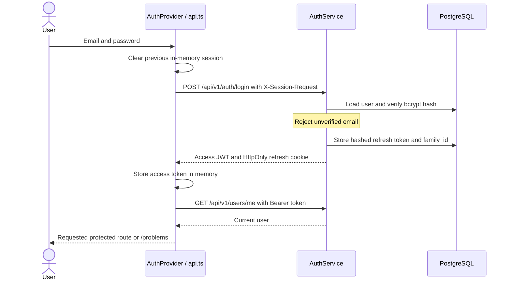
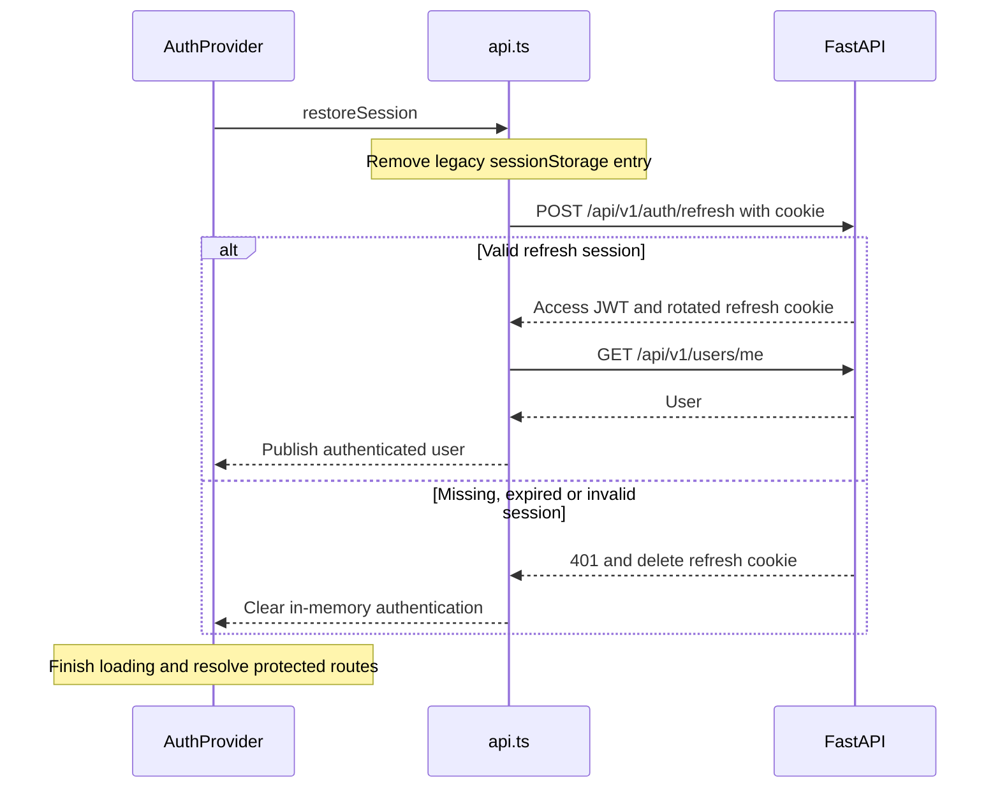
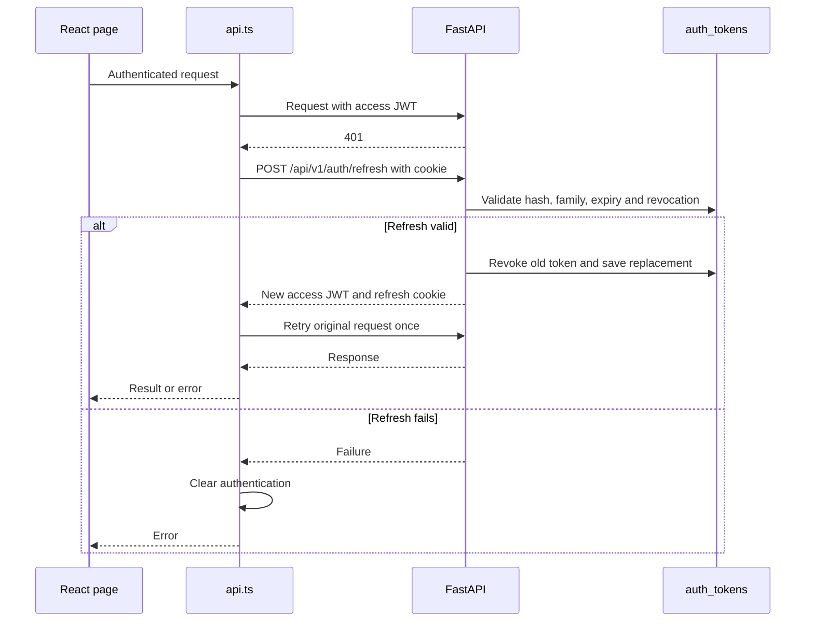
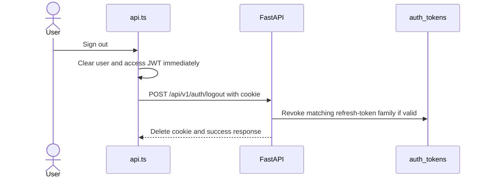

# Authentication and Sessions

Sources: [auth router](../backend/app/api/v1/routers/auth_router.py), [AuthService](../backend/app/domain/auth/service.py), [AuthRepository](../backend/app/domain/auth/repository.py), [security utilities](../backend/app/core/security.py), [typed API client](../frontend/src/api.ts) and [AuthProvider](../frontend/src/auth.js).

## Login

Access JWTs use HS256 and expire after 15 minutes by default. Refresh JWTs have a 30-day lifetime, `token_type`, `family_id` and `jti`; PostgreSQL `auth_tokens` stores SHA-256 hashes, not raw refresh credentials. Login requires email verification and removes expired/revoked token records before issuing a new family.

Registration creates an unverified account. Verification tokens are random, hashed in `account_tokens`, single-use and valid for 24 hours. Password-reset tokens use the same table with a 30-minute lifetime. Reset revokes the user's refresh sessions. Email delivery uses `EmailClient`; console mode does not print a usable verification link.

## Application Startup and Session Restoration

The public `/` landing page remains available during restoration. `ProtectedRoute` waits for loading to finish, then renders its outlet or redirects to `/login`, preserving pathname and query for return after login. Registration, login, verification and password routes are public. Problems, editor, submission results, history and progress are protected in the client and independently authorized by the API.

## Expired Access Token / Refresh Flow

`api()` makes at most one refresh attempt and one retry for an authenticated request. If another request already refreshed the access token, it reuses that token. A repeated 401 clears state. Non-401 errors and explicitly unauthenticated requests do not initiate refresh.

Concurrent refreshes within a client share a promise. Login, logout and refresh cookie mutations are serialized; Web Locks coordinate tabs where supported, with a per-instance promise queue as fallback. A generation counter prevents late responses from reviving cleared sessions. These controls do not imply server-side atomic rotation: repository rotation is not a compare-and-swap/row-lock operation.

`AuthService` revokes a family on reuse of a revoked token that is still present. Login cleanup deletes revoked rows, so family-wide reuse detection cannot be claimed after that record has been removed.

## Logout and Revocation

Logout tolerates a missing/invalid refresh token. If the request cannot reach the server, local state is cleared but server revocation and cookie deletion are not confirmed; the UI surfaces the error. Revocation does not blacklist an already issued access JWT: it can remain valid until expiry while its user exists. Account deletion removes the user and dependent authentication records.

## Why Use an HttpOnly Refresh Cookie?

A reload should restore a session without persisting a long-lived credential in browser-accessible storage. The refresh credential is set by the API and unavailable through ordinary JavaScript cookie access; the short-lived access token and current user remain module variables in `api.ts`. Neither new token is placed in localStorage or sessionStorage.

Actual cookie configuration:

| Attribute | Implementation |
|---|---|
| Name/path | `refresh_token`, `/api/v1/auth` |
| HttpOnly | Always enabled |
| Secure | Enabled when `ENV != "dev"` |
| SameSite | `lax` |
| Lifetime | `max_age` of 30 days; refresh rotation resets lifetime |
| Domain | Not set explicitly (host-scoped) |

Login, refresh and logout require `X-Session-Request: 1` and reject a supplied Origin outside `CORS_ORIGINS`. Credentialed CORS and `fetch(..., credentials: "include")` support cookie transport. Missing Origin is accepted if the custom header is present. This is custom-header/origin CSRF protection, not a synchronizer-token implementation.

The trade-off is startup network traffic, rotation coordination and cookie/origin deployment constraints. `SameSite=lax` means arbitrary cross-site frontend/API deployments may not carry the cookie even when CORS permits them; verify the actual domains. HttpOnly limits credential extraction but does not prevent injected same-origin JavaScript from making authenticated requests or reading in-memory access tokens.

Centralizing this behavior keeps pages from duplicating retry loops and accidentally storing tokens. Reconsider the session design if cross-site embedding or concurrent-client requirements exceed the current cookie/rotation contract; preserve centralized ownership and explicit revocation semantics when doing so. See [security](security.md).
