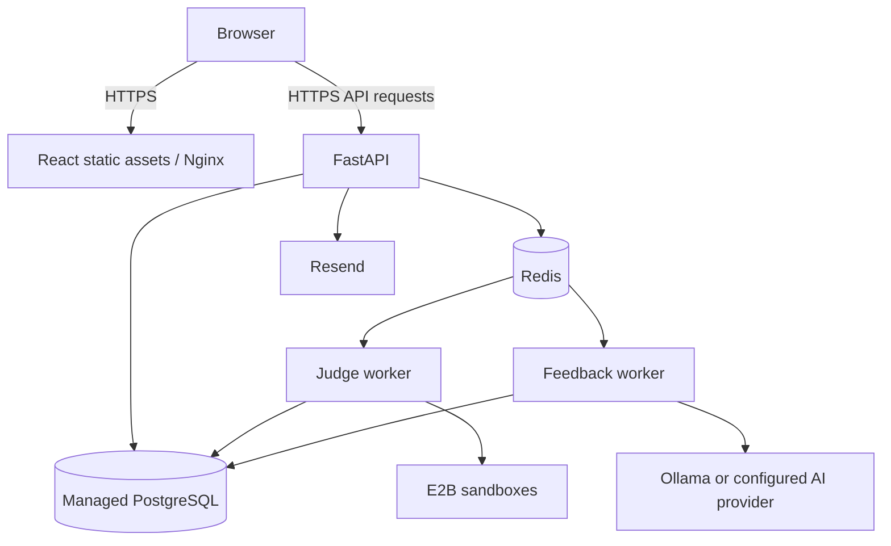

# Production deployment

This guide describes the production topology supported by the repository and the procedure for deploying a release. The README identifies Railway as the deployment platform, but there is no checked-in Railway service manifest. Live domains, service settings, replicas, volumes and backups must be verified in the deployment account; this document does not establish their current state.

Run Compose commands from the repository root. Use [local development](local-development.md) for the development environment.

## Production topology



The frontend and API need public HTTPS routes. PostgreSQL, Redis, workers and Ollama do not need public application routes. Restrict their access to the services that use them.

| Service | Repository configuration | Runtime responsibility |
|---|---|---|
| Web | `frontend/Dockerfile.production`, build context `frontend/` | Builds React with Node.js 20 and serves static assets through Nginx on port 80. |
| API | `backend/Dockerfile`, build context `backend/` | Runs FastAPI on port 8000. |
| Judge worker | `backend/Dockerfile.worker`, build context `backend/`, command `python -m app.judge.worker` | Consumes submission jobs and calls E2B. |
| Feedback worker | `backend/Dockerfile`, build context `backend/`, command `python -m app.feedback.worker` | Consumes coaching jobs and calls the configured AI provider. |
| PostgreSQL | Provisioned outside production Compose | Stores users, problems, submissions, feedback and authentication records. |
| Redis | Provisioned outside production Compose | Coordinates queues, rate limits and worker heartbeats. |
| AI provider | Provisioned separately for split workers | Ollama or the configured OpenAI provider; optional while AI generation is disabled. |

[Production Compose](../docker-compose.production.yml) defines `web`, `api`, `judge-worker` and `feedback-worker`. It does not provision PostgreSQL, Redis, Ollama, TLS termination or an API reverse proxy. [Nginx](../frontend/nginx.conf) serves the SPA and provides route fallback; browser API requests go directly to the configured API URL.

### Combined worker option

The default command in [Dockerfile.worker](../backend/Dockerfile.worker) runs [start_workers.sh](../backend/start_workers.sh), which invokes [the supervisor](../backend/app/scripts/run_workers.py). This alternative runs Ollama, the judge worker and the feedback worker in one container:

1. Start Ollama on loopback and wait for its API.
2. Download `FEEDBACK_MODEL` if it is missing.
3. Start both queue workers and monitor their processes.

Use this image's default command for a combined Railway-style worker service. Do not also start the standalone judge and feedback services for the same intended worker instance. Compose explicitly overrides the image command and therefore does not start the supervisor or Ollama.

The combined service requires `FEEDBACK_PROVIDER=ollama` and a nonempty `FEEDBACK_MODEL`, even when AI rollout flags are disabled. It forces `OLLAMA_BASE_URL=http://127.0.0.1:11434` and defaults model storage to `/data/ollama`. Attach persistent storage there, or at your explicit `OLLAMA_MODELS` path, to retain downloads across container replacement. Allow enough memory and disk for the selected model.

`OLLAMA_STARTUP_TIMEOUT_SECONDS` defaults to 60 and `OLLAMA_PULL_TIMEOUT_SECONDS` to 900. Neither worker starts until model setup completes. An unexpected child exit shuts down the whole service with failure; configure the deployment platform to restart it. This topology shares inference resources and failure behavior across both workers.

## Production configuration

For a new Compose deployment, create a protected environment file without overwriting an existing one:

```bash
cp .env.production.example .env.production
chmod 600 .env.production
```

For platform-managed services, configure equivalent variables through the platform's protected configuration mechanism. Do not commit secret values or put them in frontend build arguments. The backend settings object requires `DATABASE_URL`, `REDIS_URL` and `JWT_SECRET` in each Python service.

| Variable | Production requirement |
|---|---|
| `DATABASE_URL` | Use the `postgresql+psycopg2://` driver prefix. Supply the actual database endpoint and provider-required TLS settings; the example includes `sslmode=require`. |
| `REDIS_URL` | Supply the actual Redis endpoint, credentials and transport settings; the example uses `rediss://` for TLS. |
| `JWT_SECRET` | A strong secret from protected configuration, consistent across API replicas. Keep it stable across ordinary releases; changing it affects existing tokens. |
| `ENV` | Set `production`. Refresh cookies use `Secure` whenever this is not `dev`. |
| `REACT_APP_API_URL` | Frontend **build-time** value, such as `https://api.example.com/api/v1`. Changing a runtime variable alone does not update the built JavaScript. |
| `CORS_ORIGINS` | Explicit HTTPS frontend origins, comma-separated, such as `https://app.example.com`. |
| `FRONTEND_URL` | Public HTTPS frontend URL used in verification/reset emails. |
| `E2B_API_KEY` | Valid credential for the judge worker's remote execution provider. |
| `E2B_REQUEST_TIMEOUT_SECONDS` | Defaults to `10`; review with execution behavior before changing. |
| `EMAIL_DELIVERY_MODE` | Set `resend` for real authentication emails. |
| `RESEND_API_KEY`, `EMAIL_FROM` | Valid Resend credential and a sender accepted by your account. |
| `EMAIL_TIMEOUT_SECONDS` | Defaults to `10`. |
| `SENTRY_DSN` | Optional error-reporting configuration. |
| `FEEDBACK_AI_ENABLED`, `FEEDBACK_EVALUATION_PASSED` | Default to `false`; set both to `true` only after evaluating the selected AI configuration. |
| `FEEDBACK_PROVIDER`, `FEEDBACK_MODEL` | Explicitly select the provider and model if enabling AI. The combined service requires Ollama. |
| `OLLAMA_BASE_URL` | Reachable Ollama URL for a standalone feedback worker; the combined supervisor forces loopback. |
| `OPENAI_API_KEY` | Required if selecting the OpenAI feedback provider. |

The production example omits AI variables. Add the variables needed for your chosen topology; in particular, it is not sufficient by itself to start the combined worker. Review rate limits, feedback timeout/retry settings and other defaults in [Settings](../backend/app/core/config.py).

Configure the API and workers to use the same application database and Redis queue namespace. Keep staging and production data and queues separate.

### HTTPS and browser authentication

Terminate HTTPS at the platform ingress or a configured reverse proxy and forward to web port 80 and API port 8000. Configure the ingress target ports explicitly; the checked-in image commands do not automatically select a platform-assigned `PORT`.

The refresh cookie is HttpOnly, host-only and `SameSite=Lax`. Use HTTPS frontend and API hostnames under the same site, such as `app.example.com` and `api.example.com`. Unrelated frontend/API domains can prevent refresh-cookie use even with CORS configured. Verify login and session restoration at the final domains before opening traffic.

Production Compose publishes ports 80 and 8000 directly. Restrict direct origin access as appropriate for your ingress, and configure proxy-header trust for the actual proxy network. The repository does not include host firewall or TLS configuration.

## Release procedure

1. Select a reviewed commit and record its revision. Require the relevant [CI checks](../.github/workflows/ci.yml) to pass. CI tests and builds images but does not deploy production.
2. Verify the target database, Redis, provider credentials, domains, ingress and worker topology. Confirm a recoverable backup and review pending migrations using [backup and recovery](backup-and-recovery.md).
3. Build all release images from the same revision, including the frontend's final API URL. Retain the previous release artifacts or revision for rollback.
4. Apply migrations once from a release job or one-off backend container. For migrations incompatible with running code, pause traffic and stop API/worker processes first; this repository does not automate maintenance mode or a zero-downtime migration protocol.
5. Start or replace the API, selected worker topology and frontend. Verify health and the end-to-end workflow below before opening or restoring traffic.

### Compose commands

Use both `--env-file` and `-f` as shown. The environment-file flag provides the frontend build argument through Compose interpolation; each Python service also loads `.env.production` through its service configuration.

```bash
docker compose --env-file .env.production -f docker-compose.production.yml build
docker compose --env-file .env.production -f docker-compose.production.yml run --rm --no-deps api python -m alembic current
docker compose --env-file .env.production -f docker-compose.production.yml run --rm --no-deps api python -m alembic heads
```

After reviewing the migration plan and arranging any required maintenance window:

```bash
docker compose --env-file .env.production -f docker-compose.production.yml run --rm --no-deps api python -m alembic upgrade head
```

For an initial installation, optionally install the curated sample problems. This command inserts missing seeds and preserves existing seed records:

```bash
docker compose --env-file .env.production -f docker-compose.production.yml run --rm --no-deps api python -m app.scripts.seed_problems
```

Start the split-service topology:

```bash
docker compose --env-file .env.production -f docker-compose.production.yml up -d --wait
docker compose --env-file .env.production -f docker-compose.production.yml ps
docker compose --env-file .env.production -f docker-compose.production.yml logs --tail=100 api judge-worker feedback-worker
```

`--wait` checks configured health checks for the web/API containers and running state for workers; it does not prove successful job execution. If the release changes backend environment values, Compose recreates affected services on `up`; a simple container restart does not reload the environment file.

### Platform-managed deployment, including Railway

Configure the equivalent services using the build contexts, Dockerfiles and commands in the topology table. For a combined worker, use `backend/Dockerfile.worker` with its default command, persistent model storage and the required Ollama configuration. Run `python -m alembic upgrade head` as a single pre-release operation in the backend working directory with production credentials loaded.

Configure ingress ports and domains for web/API, health checks for `/healthz` and `/readyz`, and restart behavior for long-running workers. Confirm that the frontend build receives `REACT_APP_API_URL`. The repository provides no Railway CLI deployment script or account configuration export, so service creation, variable injection and release-job settings must be configured and reviewed in that account.

## Enable AI coaching

Keep both rollout flags disabled during initial deployment. Provision the selected provider and model first, then run the fixed evaluation suite in the feedback worker's environment:

```bash
docker compose --env-file .env.production -f docker-compose.production.yml run --rm --no-deps feedback-worker python -m app.scripts.evaluate_feedback
```

For the combined service, run `python -m app.scripts.evaluate_feedback` inside its running container after Ollama is ready; a separate container cannot reach its loopback Ollama endpoint. Evaluation calls the real provider even with the rollout flags disabled.

After a passing result and review, set `FEEDBACK_AI_ENABLED=true` and `FEEDBACK_EVALUATION_PASSED=true` and redeploy the affected Python services. Rerun evaluation after changing the model, prompt, schema or generation settings. See [AI feedback](ai-feedback.md) for the evaluation's limits and failure behavior.

## Verify a release

| Check | Expected evidence |
|---|---|
| Static frontend | Public HTTPS site loads; refreshing a nested frontend route serves the SPA; `/healthz` responds. |
| API liveness/readiness | `/health` responds and `/readyz` succeeds against PostgreSQL and Redis. |
| Schema | `alembic current` matches the intended release head. |
| Authentication | Registration email reaches a controlled test account; verification, login, page reload/session restoration and logout work at the final domains. |
| Judging | A known Python solution reaches the expected terminal result through E2B; an incorrect solution produces an appropriate candidate verdict. |
| Persistence | Submission history and progress reflect the controlled test submission. |
| Coaching | When enabled, a new eligible submission produces coaching; provider failure does not invalidate the judge result. |
| Workers | Logs show successful processing and no persistent startup/reconciliation errors. Check job age and completion, not just container state. |

The API readiness endpoint does not check worker activity, schema revision, email, E2B or AI. Worker heartbeat keys (`health:worker:<name>`) have short expirations and are supporting signals, not proof that jobs complete. Monitor queue delays, failed jobs, provider errors, API errors and database/Redis availability through your operational tooling. The repository does not provision alerts or dashboards.

Do not run backend pytest against production: its database fixtures drop and recreate tables. Use controlled smoke-test records for release verification.

## Rollback and recovery

If validation fails, pause new traffic/work as needed and inspect the API and worker errors. Redeploy the previous frontend, API and worker release only after confirming it is compatible with the current database schema. Keep the frontend's build-time API URL and shared configuration consistent during rollback.

Do not automatically run Alembic downgrades or restore a database as part of every application rollback. Review migration reversibility and data impact first. If recovery requires restoring data, use the isolated restore and verification procedure in [backup and recovery](backup-and-recovery.md), including session/deletion reconciliation and fresh isolated queues.

Record the release revision, applied migration, validation outcome and any rollback actions without copying secrets or candidate data into the release log.
