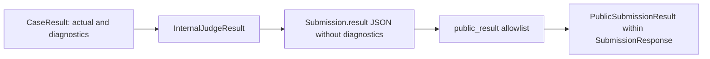

# Security Model

This document describes implemented boundaries and their limitations, not a security certification. Sources are the [API routers](../backend/app/api/v1/routers), [auth service](../backend/app/domain/auth/service.py), [execution provider](../backend/app/judge/execution_provider.py), [feedback policy](../backend/app/feedback/policy.py), and [settings](../backend/app/core/config.py).

## Trust Boundaries

| Boundary | Implemented protection | Limitation / operational consequence |
|---|---|---|
| Browser to API | Access JWT validation, database user lookup, role and ownership checks; centralized client session handling. | Client route guards alone are not authorization. Access JWTs are not immediately invalidated by refresh-family revocation. |
| Session cookie | HttpOnly, Secure outside dev, SameSite Lax, auth-only path; custom session header and Origin check. | XSS can still make authenticated requests. Verify actual cross-site behavior and production `ENV`. |
| Candidate-facing responses | Explicit response schemas and a defensive internal-to-public result projection. | Source and problem text are intentionally user-visible; access control must accompany schema filtering. |
| Untrusted Python | Fresh E2B sandbox per case, internet access disabled, command timeout and cleanup attempt. | Current code does not configure explicit CPU/memory quotas or sample memory. Returned-output size checks occur after collection. |
| Hidden tests | Worker loads hidden cases; APIs omit them; expected values are compared outside the sandbox. | Executing code sees the current test input. Seed hidden cases are readable in this public repository. |
| AI provider | Fresh `FeedbackContext`, schema validation, separate verdict/coaching persistence, prompt instructions. | Text can contain prompt injection or user-embedded secrets. Schema validity does not prove correctness or instruction compliance. |
| Configuration | Environment-based configuration; API keys represented as `SecretStr`; `.env` files ignored. | `DATABASE_URL`, `REDIS_URL` and `JWT_SECRET` are strings in Settings. Masking and gitignore are not a secret manager. |

See [authentication](authentication.md) for exact cookie and refresh behavior.

## Why Separate Internal Judge Results From Public API Responses?

The execution adapter knows raw stdout/stderr, exit codes, runtime errors and provider failures. Exposing that data as the candidate result could reveal hidden inputs, infrastructure paths or uncontrolled exception text. [results.py](../backend/app/domain/submissions/results.py) separates per-case `CaseResult` from aggregate `InternalJudgeResult`. The latter contains status, verdict code, counts, measurements and a serialization-excluded diagnostics field.

[schemas.py](../backend/app/domain/submissions/schemas.py) constructs `PublicSubmissionResult` with exactly:

- `message`: fixed catalog text derived from known status/verdict codes.
- `tests_passed`, `tests_total`: valid aggregate integer counts, bounded to 40.
- `runtime_ms`: finite nonnegative measurement, bounded to 180,000.
- `memory_bytes`: valid nonnegative integer bounded to 128 MiB, or null. This projection bound is not a sandbox memory limit.

`SubmissionResponse` also exposes `id`, `user_id`, `problem_id`, `code`, `language`, `status`, `created_at`, and `updated_at`. Its pre-validator copies only declared fields and projects every stored result; admins receive the same result projection. Queued/running results are null. Historical strings are size-limited before parsing; arbitrary stored messages/nested objects are not echoed. Unknown statuses map to `RUNTIME_ERROR`.

Hidden inputs/expected outputs, per-test actual results, raw diagnostics, stack traces, commands, sandbox identifiers and internal filesystem paths are absent from this result schema. [ProblemResponse](../backend/app/domain/problems/schemas.py) similarly omits `hidden_test_cases`, including on admin reads. The judge logs internal diagnostics separately; they are not safe for public log exposure.

This costs a second schema and limits candidate debugging detail. It protects the API from accidental field additions to internal result objects. Reconsider individual public fields only when a concrete debugging need can be met without revealing hidden data; do not return the internal JSON blob directly.

## AI Data Boundary

[FeedbackContext](ai-feedback.md#why-use-feedbackcontext) contains public problem information, submitted code, a persisted verdict and safe aggregates. It does not select identity/session data, hidden tests or raw judge exceptions. Inputs are explicitly constructed, not broadly serialized and subsequently redacted. Prompt text tells the model not to follow embedded instructions, but the live validator primarily enforces structure and solution syntax. Suggested code is displayed, not automatically executed.

## Implemented Operational Controls

### Execution and failure handling

Only Python submissions are accepted, capped at 64,000 bytes/characters with null-byte rejection. Test cases have count and size limits. The E2B adapter writes only the source, current input and fixed runner; application credentials are not intentionally injected into the sandbox. Outbound internet is disabled via the SDK option. Each command has a time limit, API operations have request timeouts, and cleanup runs in `finally`; cleanup failures are logged. See [submission lifecycle](submission-lifecycle.md) for retry and lease limits.

Infrastructure errors use `UNAVAILABLE` internally and a safe public message rather than a wrong-answer verdict. They share the `RUNTIME_ERROR` status with candidate runtime failures. There is no distinct infrastructure-status enum.

### Rate limiting

[RedisRateLimiter](../backend/app/core/rate_limit.py) uses fixed-window increment/expiry counters. Defaults are login 10/300 seconds, registration 5/3,600, resend verification 5/3,600, submission creation 30/3,600 and feedback requests 10/3,600. Auth endpoint identity derives from a hash of `request.client.host`; proxy configuration affects what that host represents. Submission and feedback creation use user ID. Redis limits return 429 with `Retry-After` and fail open on Redis errors.

Feedback also counts recent PostgreSQL feedback rows. This is not a complete request-attempt ledger: retries reuse existing rows. Forgot-password, reset-password and refresh routes have no explicit rate-limiter call in their router. Do not describe every authentication endpoint as rate-limited. Reconsider failure-open behavior and coverage if abuse or provider costs justify a stricter availability trade-off.

### Audit, logging and errors

[AuditEvent](../backend/app/audit.py) stores event type, actor, target, optional IP/metadata and timestamp. Current call sites record registration, verification, login success/failure, session revocation/rotation, submission creation and account deletion. `_safe_metadata` drops a fixed set of sensitive top-level keys; it is neither recursive redaction nor a guarantee for arbitrary future metadata.

Important current gaps: [RequestIDMiddleware](../backend/app/core/logging.py) logs the full URL, so verification query tokens can appear in server logs. The judge logs raw diagnostics. [Sentry initialization](../backend/app/core/sentry.py) configures tracing but no application-specific scrubbing hook. Keep logs restricted and review redaction before making a general “no secrets in logs” claim. Feedback-worker validation logs are deliberately narrower: exception types and approved locations only.

### Authorization and data lifecycle

Problem mutation requires admin role; normal problem reads hide archived problems, while admins can request inactive records. Submission reads/deletion require ownership or admin status; generation requests require ownership. `get_current_user` validates token type and user existence; it does not check refresh-family revocation for access-token requests.

[UserService.delete_account](../backend/app/domain/user/service.py) deletes feedback, submissions, auth/account tokens, profile and user, leaving shared problems and an audit event. No scheduled audit purge or general age-based retention job was found. A restored backup can reintroduce deleted data and previously valid sessions; [recovery](backup-and-recovery.md) requires operator review before reconnecting it.

### Secrets and deployment

Use deployment environment variables for database/Redis endpoints, signing secrets and provider keys; keep values out of documentation and shell output. The production Compose file expects an operator-supplied environment file. No automated secret rotation, vault integration or TLS termination policy is provisioned by this repository. Those are deployment responsibilities, not implemented guarantees.
