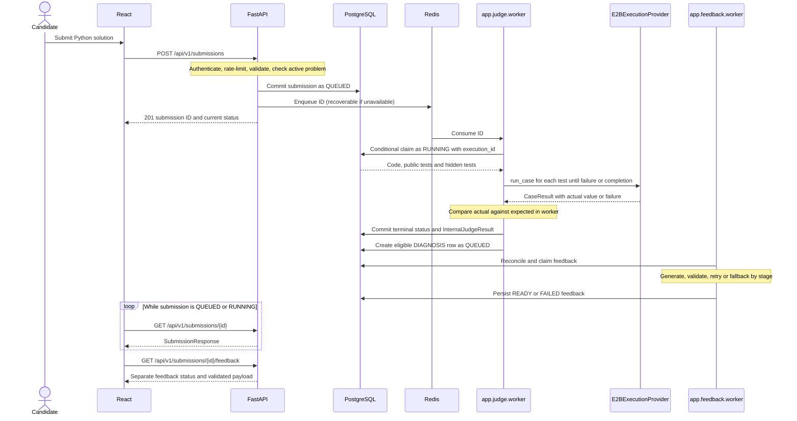

# Submission Lifecycle

The judge and coaching pipelines commit independently. There is no submission status named `COMPLETED` or `INFRASTRUCTURE_ERROR`.

Sources: [submission routes](../backend/app/api/v1/routers/submissions_router.py), [service](../backend/app/domain/submissions/service.py), [worker](../backend/app/judge/worker.py), [result types](../backend/app/domain/submissions/results.py), and [frontend editor](../frontend/src/pages/ProblemDetail.js).

## Request and Durable Dispatch

The browser sends `{problem_id, code, language}`; Python is the only accepted language. `SubmissionCreate` limits source to 64,000 characters and bytes and rejects null bytes. The editor offers submission, not a separate run-only endpoint.

`AuthService.get_current_user` validates an access JWT and loads its user. The route derives `user_id` from that user, rate-limits by user, and requires an active problem. `SubmissionsService` persists `QUEUED`, records `SUBMISSION_CREATED`, commits, then enqueues the ID. Redis enqueue failure returns `False` and leaves the saved row available to reconciliation. A fast worker may advance the row before the response is observed.

Detail/deletion allow the owner or an admin; history is owner-scoped except that admins can list all submissions. Feedback reads also allow admins, but generation requests enforce submission ownership. See [authentication](authentication.md).

## Execution and Exact States

| Submission state | Meaning |
|---|---|
| `QUEUED` | Durable pending work, whether or not Redis currently contains its ID. |
| `RUNNING` | Worker holds a conditional database claim identified by `execution_id`. |
| `PASSED` | Every executed test returned the expected value and all cases completed. |
| `FAILED` | Returned value differs from the expected value (wrong answer). |
| `RUNTIME_ERROR` | Candidate execution/output problem, unsupported language, or infrastructure/configuration problem; inspect internal `verdict_code` for the distinction. |
| `TIME_LIMIT_EXCEEDED` | Per-case command timeout or exhausted evaluation budget. |

`process_submission` claims only `QUEUED` rows, then loads source and the current problem tests. Test inputs are not snapshotted with the submission: queued work uses the problem data loaded at evaluation time. [parse_cases](../backend/app/domain/problems/judge_cases.py) accepts up to 20 public and 20 hidden cases, separately limited to 128,000 bytes and 60,000 bytes per case. Inputs map Python argument names to JSON values. An empty combined suite cannot pass.

[E2BExecutionProvider](../backend/app/judge/execution_provider.py) creates a fresh sandbox for each case, with `secure=True` and `allow_internet_access=False`. It writes source, that case's input, and a runner that calls `solve(**arguments)`. Expected answers remain in the worker. Sandbox code necessarily sees its current input; “hidden” means withheld from candidate-facing APIs, not invisible to the running program.

The command receives at most six seconds. Sandbox lifetime is at least ten seconds; provider requests default to ten seconds. `evaluate` checks a remaining budget of `90 - 20 - elapsed` before each case. Setup, retries and cleanup are additional operations, so this is not a hard wall-clock cancellation deadline for the whole job. Cleanup is attempted in `finally`.

Successful stdout must be valid JSON and at most 64 KiB; extra user `print` output can invalidate it. The worker compares decoded Python values using `!=`, without a custom float tolerance or canonical-JSON comparator. It stops at the first failed case. Runtime sums available provider wall-time measurements around operations after sandbox creation; the current adapter does not populate memory measurements. No repository-configured E2B CPU or memory quota is asserted here.

Final persistence requires matching ID, `RUNNING` status and `execution_id`; a stale worker cannot overwrite a replacement claim. `InternalJudgeResult` is serialized as JSON text, excluding its diagnostics field. Diagnostics may still enter restricted worker logs.

## Recovery and Polling

The judge scans between jobs approximately every ten seconds, requeues `RUNNING` rows older than 180 seconds and dispatches up to 1,000 pending IDs. There is no judge lease-renewal thread. Slow provider operations can outlive the lease: this design is at-least-once execution with fenced writes, not exactly-once sandbox execution.

After result persistence, `initial_feedback` creates a unique `DIAGNOSIS` row only when `judge_ready` accepts the result. Feedback reconciliation repairs a crash between judge commit and feedback scheduling. Failed candidate results can be eligible; infrastructure `UNAVAILABLE` results are not.

[useResource](../frontend/src/ui.js) polls submission detail every two seconds while `QUEUED`/`RUNNING`, stopping on completion or request error; cleanup aborts requests and clears timers. [FeedbackPanel](../frontend/src/FeedbackPanel.js) polls separately when eligible feedback is absent or queued/running. It offers retries on errors. No WebSocket or SSE path is implemented.

## Why Process Submissions Asynchronously?

Sandbox setup, up to 40 sequential cases, provider retries and model generation can take much longer than a normal API request. Returning an ID after persistence avoids coupling the request lifetime to those operations. Independent worker processes keep untrusted execution orchestration and inference latency outside API handlers, while judge/feedback failures can be handled separately.

The accepted cost is Redis plus workers, conditional state transitions, eventual consistency, reconciliation, polling and lease recovery. The UI must distinguish a saved attempt from a completed evaluation. Reconsider the coordination mechanism when queue scans, polling traffic or provider concurrency become bottlenecks; moving execution back into the request would not solve the underlying latency.

## Failure Semantics

| Boundary | Current handling |
|---|---|
| Wrong answer | `FAILED` / `FAILED`; no infrastructure retry. |
| User exception or invalid JSON stdout | `RUNTIME_ERROR` / `RUNTIME_ERROR`. Oversized stdout uses `OUTPUT_LIMIT`. |
| Timeout | `TIME_LIMIT_EXCEEDED`; partial aggregates may be unavailable when the whole budget expires. |
| E2B transient error | Up to three adapter attempts, exponential delay starting at 0.25 seconds, capped at two seconds plus jitter. Authentication/missing-key errors are not transient. |
| Exhausted provider/unexpected judging error | `RUNTIME_ERROR` / `UNAVAILABLE`, with a fixed public “temporarily unavailable” message. There is no automatic whole-job retry after this terminal result. |
| Test/configuration issue | Empty tests use `INVALID_TESTS`; parse exceptions fall through to `UNAVAILABLE`. Unsupported stored languages use `UNSUPPORTED_LANGUAGE`. |
| AI failure | Independent `submission_feedback` status. `DIAGNOSIS`/`HINT` can become `READY` with deterministic fallback; `SOLUTION` becomes `FAILED` if no valid code is produced. |

**Infrastructure failure != Wrong Answer**, but infrastructure failure does share the public `RUNTIME_ERROR` status. **AI failure != Judge failure**: coaching never overwrites the judged submission. A completed verdict remains accessible even while feedback fails or is retried.

Related: [architecture](architecture.md), [AI feedback](ai-feedback.md), [security](security.md).
